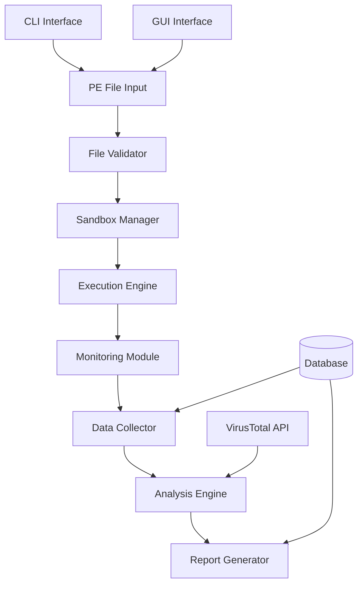

# PE 파일 동적 분석 시스템 - 상세 설계 명세서

## 1. 프로젝트 개요

### 1.1 시스템 명칭
**MalwareAnalyzer Pro** - Advanced PE Dynamic Analysis System

### 1.2 핵심 목표
- PE 파일의 동적 행위 분석
- 샌드박스 환경에서의 안전한 실행
- 상세한 행위 로깅 및 아티팩트 수집
- VirusTotal 연동을 통한 위협 평가

### 1.3 기술 스택
```yaml
Core Technologies:
  Programming Language: Python 3.10+
  Sandbox: 
    - Windows Sandbox API
    - VirtualBox API (대안)
  Monitoring:
    - WMI (Windows Management Instrumentation)
    - ETW (Event Tracing for Windows)
    - Detours/API Hooking
  GUI Framework: PyQt6 / Electron
  CLI Framework: Click / Typer
  Database: SQLite / PostgreSQL
  API Integration: VirusTotal API v3
```

## 2. 시스템 아키텍처

### 2.1 컴포넌트 구조



### 2.2 모듈별 상세 설계

#### 2.2.1 File Validator Module
```python
class PEFileValidator:
    """PE 파일 유효성 검증 모듈"""
    
    def __init__(self):
        self.supported_formats = ['.exe', '.dll', '.sys', '.scr']
        self.max_file_size = 100 * 1024 * 1024  # 100MB
        
    def validate(self, file_path: str) -> ValidationResult:
        """
        검증 항목:
        - PE 헤더 검증
        - 파일 크기 확인
        - 디지털 서명 확인
        - 엔트로피 분석
        - 패킹 탐지
        """
        pass
        
    def extract_metadata(self, file_path: str) -> PEMetadata:
        """
        추출 정보:
        - Import Table
        - Export Table
        - Section Information
        - Resource Information
        - Version Information
        """
        pass
```

#### 2.2.2 Sandbox Manager
```python
class SandboxManager:
    """샌드박스 환경 관리 모듈"""
    
    def __init__(self, config: SandboxConfig):
        self.vm_type = config.vm_type  # VirtualBox, VMware, Hyper-V
        self.snapshot_name = config.snapshot
        self.timeout = config.timeout
        
    def prepare_environment(self) -> Environment:
        """
        환경 준비:
        - VM 스냅샷 복원
        - 네트워크 격리 설정
        - 모니터링 에이전트 배포
        - 시간 동기화
        """
        pass
        
    def deploy_sample(self, file_path: str) -> bool:
        """
        샘플 배포:
        - 파일 전송
        - 실행 권한 설정
        - 트리거 설정
        """
        pass
```

## 3. 모니터링 시스템 설계

### 3.1 Process Monitor 구현

```python
class ProcessMonitor:
    """프로세스 행위 모니터링"""
    
    def __init__(self):
        self.monitored_events = {
            'process_creation': True,
            'process_termination': True,
            'thread_creation': True,
            'image_load': True,
            'registry_access': True,
            'file_system': True,
            'network': True
        }
        
    def start_monitoring(self) -> None:
        """
        ETW 세션 시작
        WMI 이벤트 구독
        """
        pass
        
    def capture_api_calls(self) -> List[APICall]:
        """
        API 호출 캡처:
        - Kernel32.dll
        - Ntdll.dll
        - Advapi32.dll
        - User32.dll
        - Ws2_32.dll
        """
        pass
```

### 3.2 행위 로깅 스키마

```sql
-- 메인 실행 테이블
CREATE TABLE executions (
    execution_id UUID PRIMARY KEY,
    file_hash VARCHAR(64),
    file_name VARCHAR(255),
    start_time TIMESTAMP,
    end_time TIMESTAMP,
    sandbox_id VARCHAR(50),
    status VARCHAR(20)
);

-- 프로세스 이벤트
CREATE TABLE process_events (
    event_id BIGSERIAL PRIMARY KEY,
    execution_id UUID REFERENCES executions(execution_id),
    timestamp TIMESTAMP,
    event_type VARCHAR(50),
    process_id INTEGER,
    parent_process_id INTEGER,
    process_name VARCHAR(255),
    command_line TEXT,
    user_name VARCHAR(100)
);

-- API 호출
CREATE TABLE api_calls (
    call_id BIGSERIAL PRIMARY KEY,
    execution_id UUID REFERENCES executions(execution_id),
    timestamp TIMESTAMP,
    process_id INTEGER,
    thread_id INTEGER,
    api_name VARCHAR(255),
    module_name VARCHAR(255),
    parameters JSONB,
    return_value VARCHAR(100)
);

-- 파일 시스템 활동
CREATE TABLE file_operations (
    operation_id BIGSERIAL PRIMARY KEY,
    execution_id UUID REFERENCES executions(execution_id),
    timestamp TIMESTAMP,
    operation_type VARCHAR(20),
    file_path TEXT,
    process_id INTEGER,
    status VARCHAR(20),
    file_hash VARCHAR(64)
);

-- 레지스트리 활동
CREATE TABLE registry_operations (
    operation_id BIGSERIAL PRIMARY KEY,
    execution_id UUID REFERENCES executions(execution_id),
    timestamp TIMESTAMP,
    operation_type VARCHAR(20),
    key_path TEXT,
    value_name VARCHAR(255),
    value_data TEXT,
    process_id INTEGER
);

-- 네트워크 활동
CREATE TABLE network_connections (
    connection_id BIGSERIAL PRIMARY KEY,
    execution_id UUID REFERENCES executions(execution_id),
    timestamp TIMESTAMP,
    protocol VARCHAR(10),
    local_address VARCHAR(50),
    local_port INTEGER,
    remote_address VARCHAR(50),
    remote_port INTEGER,
    process_id INTEGER,
    bytes_sent BIGINT,
    bytes_received BIGINT
);
```

## 4. 데이터 수집 및 덤프

### 4.1 아티팩트 수집기

```python
class ArtifactCollector:
    """실행 중 생성된 아티팩트 수집"""
    
    def __init__(self, execution_id: str):
        self.execution_id = execution_id
        self.artifacts_dir = f"./artifacts/{execution_id}"
        
    def collect_dropped_files(self) -> List[DroppedFile]:
        """
        수집 대상:
        - 새로 생성된 파일
        - 수정된 실행 파일
        - 임시 파일
        """
        pass
        
    def dump_process_memory(self, pid: int) -> MemoryDump:
        """
        메모리 덤프:
        - 전체 프로세스 메모리
        - 힙 영역
        - 스택 영역
        - 언패킹된 코드 영역
        """
        pass
        
    def capture_network_traffic(self) -> NetworkCapture:
        """
        네트워크 캡처:
        - PCAP 파일 생성
        - DNS 쿼리
        - HTTP/HTTPS 트래픽
        - C&C 통신
        """
        pass
```

## 5. VirusTotal 통합

### 5.1 VT API 클라이언트

```python
class VirusTotalClient:
    """VirusTotal API v3 클라이언트"""
    
    def __init__(self, api_key: str):
        self.api_key = api_key
        self.base_url = "https://www.virustotal.com/api/v3"
        
    async def submit_file(self, file_path: str) -> VTSubmission:
        """파일 제출 및 스캔"""
        pass
        
    async def get_file_report(self, file_hash: str) -> VTReport:
        """
        보고서 내용:
        - 탐지 엔진 결과
        - 행위 분석
        - 샌드박스 보고서
        - YARA 규칙 매칭
        - 유사 샘플
        """
        pass
        
    async def search_similar_samples(self, file_hash: str) -> List[SimilarSample]:
        """유사 악성코드 검색"""
        pass
```

## 6. CLI 인터페이스

### 6.1 명령어 구조

```bash
# 기본 분석 실행
malanalyzer analyze <file_path> [options]

# 옵션
--timeout <seconds>          # 실행 제한 시간 (기본: 300초)
--sandbox <type>            # 샌드박스 타입 (virtualbox|vmware|hyperv)
--network <mode>            # 네트워크 모드 (isolated|limited|full)
--dump-memory              # 메모리 덤프 활성화
--vt-scan                  # VirusTotal 스캔 활성화
--output <format>          # 출력 형식 (json|html|pdf)
--verbose                  # 상세 로그 출력

# 배치 분석
malanalyzer batch <directory> --config <config.yaml>

# 보고서 생성
malanalyzer report <execution_id> --format <pdf|html|json>

# 실시간 모니터링
malanalyzer monitor <execution_id> --follow

# 데이터베이스 쿼리
malanalyzer query --hash <md5|sha256> 
malanalyzer query --date <date_range>
malanalyzer query --behavior <behavior_pattern>
```

### 6.2 설정 파일 (config.yaml)

```yaml
sandbox:
  type: virtualbox
  vm_name: "Windows10_Sandbox"
  snapshot: "clean_state"
  memory: 4096
  cpu_cores: 2
  
monitoring:
  api_hooks: true
  network_capture: true
  screenshot_interval: 5
  memory_dump: true
  
analysis:
  timeout: 300
  kill_on_timeout: true
  collect_artifacts: true
  
virustotal:
  api_key: "YOUR_API_KEY"
  auto_submit: true
  wait_for_results: true
  
output:
  directory: "./reports"
  format: "json"
  include_pcap: true
  include_memory_dump: false
```

## 7. GUI 인터페이스

### 7.1 메인 윈도우 구조

```python
class MainWindow(QMainWindow):
    """GUI 메인 윈도우"""
    
    def __init__(self):
        super().__init__()
        self.init_ui()
        
    def init_ui(self):
        """
        UI 구성요소:
        1. 파일 선택 영역 (Drag & Drop 지원)
        2. 분석 옵션 패널
        3. 실시간 모니터링 뷰
        4. 결과 탭 (Overview, Processes, Network, Registry, Files)
        5. 타임라인 뷰
        6. 보고서 생성 버튼
        """
        pass
```

### 7.2 GUI 레이아웃

```
┌──────────────────────────────────────────────────────────┐
│  File  Analysis  View  Tools  Help                        │
├──────────────────────────────────────────────────────────┤
│ ┌─────────────────┐  ┌──────────────────────────────────┤
│ │                 │  │ Analysis Options                 │
│ │  Drag & Drop    │  │ □ Enable Network                │
│ │   PE File       │  │ □ Memory Dump                   │
│ │                 │  │ □ VirusTotal Scan               │
│ │                 │  │ Timeout: [300] seconds          │
│ └─────────────────┘  └──────────────────────────────────┤
├──────────────────────────────────────────────────────────┤
│ Tabs: [Overview][Processes][Network][Registry][Files][VT] │
│ ┌──────────────────────────────────────────────────────┐ │
│ │                                                      │ │
│ │              Real-time Monitoring View               │ │
│ │                                                      │ │
│ └──────────────────────────────────────────────────────┘ │
├──────────────────────────────────────────────────────────┤
│ Timeline: [======================>                    ]   │
├──────────────────────────────────────────────────────────┤
│ Status: Analyzing... | Progress: 45% | Time: 02:15       │
└──────────────────────────────────────────────────────────┘
``
