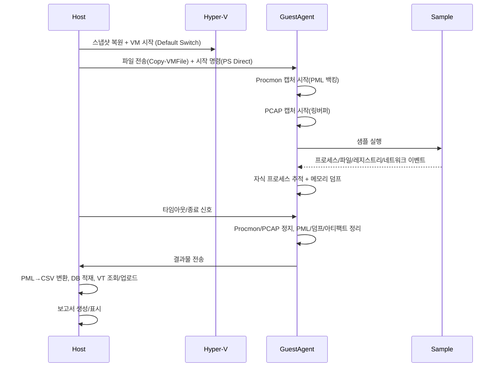

아래 내용은 요청하신 스펙(Hyper‑V, 기본 하이퍼바이저 스위치, 모든 자식 프로세스 메모리 덤프, VirusTotal 미존재 시 자동 업로드, WPF(.NET) Windows 전용, 성능 최적화)에 맞춰 백로그/마일스톤/구체 UI 와이어프레임/설정 템플릿을 일관된 형태로 정리한 것입니다.

개요
- 제품명: MalwareAnalyzer Pro (Windows 전용)
- 호스트: .NET 8 C# (WPF GUI + CLI), Hyper‑V 제어
- 게스트: Windows 10/11 VM (Agent 서비스 + Procmon + SharpPcap/Npcap)
- 네트워크: Hyper‑V “Default Switch” 사용
- 분석 흐름: 호스트가 VM 스냅샷 복원 → 게스트 Agent 구동 → Procmon/ETW/PCAP 캡처 → 샘플 실행 → 자식 프로세스 포함 메모리 덤프 → 아티팩트 수집 → PML/PCAP/덤프/로그 회수 → VirusTotal 조회/업로드 → 보고서

1) 마일스톤 로드맵
- M0. 프로젝트 부트스트랩 (1주)
  - 산출물: 아키텍처 다이어그램, 공통 스키마, 솔루션 레이아웃, CI 템플릿
  - 완료 기준: 솔루션 빌드/테스트/리너 실행, 핵심 의존성(Procmon/Npcap) 체크 스크립트

- M1. Hyper‑V 샌드박스 매니저 & 게스트 준비 (2주)
  - 내용: 스냅샷 복원/재설정, Default Switch 연결, VM Guest Services 활성화, PowerShell Direct 파일 전송/원격 실행
  - 완료 기준: 샘플 파일을 게스트로 전송/실행하고 표준 출력을 회수

- M2. 모니터링 베이스라인 (Procmon + ETW) (3주)
  - 내용: 게스트에서 Procmon 비대화형 캡처(PML) 시작/중지/회수, ETW 보조(프로세스/파일/레지스트리/네트워크), PML→CSV 변환→DB 적재 파이프라인
  - 완료 기준: 지정 시간 동안 실행된 샘플의 프로세스/파일/레지스트리/네트워크 이벤트가 DB/JSON에 누락 없이 적재

- M3. 메모리 덤프(모든 자식 프로세스) & 아티팩트 수집 (2주)
  - 내용: ETW/Procmon 트리로 자식 프로세스 추적, MiniDumpWriteDump/ProcDump로 -ma 전체 덤프, 드롭/수정 파일 및 레지스트리 스냅샷 수집
  - 완료 기준: 트리 내 모든 프로세스에 대해 최소 1회 풀 덤프 생성 및 회수

- M4. 네트워크 캡처(PCAP) (1주)
  - 내용: 게스트에서 Npcap + SharpPcap로 PCAP 지속 캡처(링버퍼), DNS/HTTP/HTTPS 태깅
  - 완료 기준: 분석 동안 생성된 PCAP 파일과 요약 통계(도메인/아이피/바이트)가 DB/리포트에 반영

- M5. VirusTotal 통합 (1주)
  - 내용: SHA-256 조회 후 미존재 시 자동 업로드 및 폴링, 결과 캐시 및 API 레이트 리밋
  - 완료 기준: VT 결과(엔진 탐지 수, 링크, 샌드박스 요약)가 리포트에 포함

- M6. CLI (1주)
  - 내용: analyze/batch/report/monitor 명령, 구성 파일 읽기, 출력 포맷(json/html)
  - 완료 기준: CLI로 end-to-end 분석 및 보고서 생성

- M7. WPF GUI v1 (3주)
  - 내용: 프로젝트/실행 대시보드, 새 분석 마법사, 실시간 뷰(프로세스 트리/탭), 타임라인, VT 탭
  - 완료 기준: GUI에서 분석 생성→모니터링→결과 열람 및 보고서 내보내기

- M8. 성능 최적화 스프린트 (1주 집중 + 상시)
  - 내용: ETW 필터/배치 적재/인덱스 최적화, UI 가상화, 파일 전송/압축 개선, 병렬 처리
  - 완료 기준: 5분 분석에 대해 95퍼센타일 총 처리시간 ≤ 2분, UI 10만 이벤트 스크롤 60fps 유지

- M9. 패키징/하드닝/문서화 (1주)
  - 내용: 설치 패키지, 런북, 운영 가이드, Legal(Procmon/Npcap 라이선스), 샘플 데이터
  - 완료 기준: 단일 설치/설정으로 분석 수행 가능, 운영 문서 완비

2) 제품 백로그(에픽/태스크/수용 기준)
- 에픽 A. Hyper‑V 샌드박스
  - A1: Hyper‑V VM 연결(Default Switch) 및 스냅샷 복원
    - 기준: Restore-VMCheckpoint 성공, VM Running, 게스트 IP 확인
  - A2: Guest Services로 파일 전송/명령 실행(PowerShell Direct)
    - 기준: Copy-VMFile/Invoke-Command로 샘플 실행 OK
  - A3: 격리/재현성 보장(시간 동기화, 사용자 프로필 초기화)
    - 기준: 매 실행 동일 초기 상태, 시간 오차 < 2초

- 에픽 B. 게스트 Agent
  - B1: Windows 서비스로 상시 대기(ETW 구독/PCAP 핸들)
  - B2: Procmon 비대화형 컨트롤(Start/Stop/Save)
  - B3: 안전 종료 시그널 처리(타임아웃/강제종료 전 수집 마무리)
  - 기준: 호스트 명령으로 시작~정지 전 과정 자동화

- 에픽 C. 모니터링/수집
  - C1: Procmon PML 캡처 + 오프라인 CSV 변환
    - 기준: PML→CSV 변환 정확도 99% 이상, 누락 없이 DB 적재
  - C2: ETW 보조(프로세스/이미지 로드/레지스트리/파일/네트워크)
    - 기준: Procmon 비가용 시 ETW로 핵심 이벤트 대체 수집
  - C3: PCAP 캡처(SharpPcap, 링버퍼)
    - 기준: 500MB 제한 링버퍼에서 Dropped packet < 1%

- 에픽 D. 메모리 덤프 & 아티팩트
  - D1: 자식 프로세스 트리 추적(ETW/Procmon 상관)
  - D2: MiniDumpWriteDump(Full) + 큰 프로세스 분할 덤프(옵션)
  - D3: 드롭 파일/수정 파일/레지스트리 하이브 스냅샷
  - 기준: 트리 내 모든 PID에 최소 1개 풀 덤프, 파일/레지스트리 해시 포함

- 에픽 E. 데이터 계층/리포트
  - E1: 스키마(Executions/Process/Api/FS/Reg/Net/VT) 인덱스
  - E2: 배치 적재(Bulk insert), 파티셔닝(날짜/실행ID)
  - E3: HTML/JSON 보고서 템플릿
  - 기준: 10분 분석의 200만 이벤트 적재 < 60초, 질의 p95 < 300ms

- 에픽 F. VirusTotal
  - F1: SHA-256 조회 → 미존재 시 자동 업로드 → 폴링(wait)
  - F2: 레이트 리밋/백오프/캐시(파일/메모리)
  - 기준: 신규 샘플 결과 5분 내 반영(대기 허용), 재조회는 캐시 Hit

- 에픽 G. CLI
  - G1: analyze/batch/report/monitor 하위 명령, config 파싱
  - 기준: 명령어만으로 end-to-end 실행 가능

- 에픽 H. WPF GUI
  - H1: 대시보드/새 분석/실시간/탭/타임라인/VT
  - H2: 대용량 그리드 가상화, 검색/필터, 내보내기
  - 기준: 10만 행 UI 조작 시 60fps 유지

- 에픽 I. 성능/관측
  - I1: 메트릭(처리량/지연/CPU/메모리), 트레이스
  - I2: 핫패스 최적화(비동기 파이프라인, 압축/병렬)
  - 기준: M8 목표 달성

3) 분석 플로우(호스트↔게스트)


4) WPF GUI 구체 와이어프레임
- 메인(대시보드)
  - 좌측: 프로젝트/필터
  - 우측 상단: 실행 목록(상태/샘플명/시간/탐지)
  - 우측 하단: 선택 실행 요약

```
┌───────────────────────────────────────────────────────────────────────┐
│ MalwareAnalyzer Pro                                     [Settings ⚙] │
├───────────────┬───────────────────────────────────────────────────────┤
│ Projects/Tags │  New Analysis ▶                                    ⓘ │
│ - All         │  Search: [sha256/file/ip/domain] [🔍]                 │
│ - Recent      ├───────────────────────────────────────────────────────┤
│ - VT:bad      │ Executions                                            │
│ - Manual      │ ┌───────────────────────────────────────────────────┐ │
│               │ │ ☐ Live  ID    Sample           Start     Verdict │ │
│               │ │ ▣ 123  foo.exe          10:21:03  Suspicious     │ │
│               │ │ □ 122  bar.dll          09:58:10  Malicious (23) │ │
│               │ │ ...                                               │ │
│               │ └───────────────────────────────────────────────────┘ │
│               ├───────────────────────────────────────────────────────┤
│               │ Summary (selected execution)                          │
│               │ ProcTree: 7 procs | Files: 42 | Reg: 58 | Net: 12     │
│               │ VT: 23/70 | Duration: 04:59                           │
└───────────────┴───────────────────────────────────────────────────────┘
```

- 새 분석 마법사
  - 단계 1: 파일 드롭/경로 입력, 해시 계산
  - 단계 2: 옵션(타임아웃, VT 스캔, 메모리 덤프, PCAP)
  - 단계 3: 샌드박스 선택(Hyper‑V VM, 스냅샷), 네트워크(Default Switch 고정)
  - 요약/시작 버튼

```
┌──────────────────── New Analysis ───────────────────────┐
│ File: [ Drag & Drop or Browse... ] [Compute Hash]       │
│ Options: [x] VT Scan (auto-upload)                      │
│          [x] Dump all child processes (Full)            │
│          [x] Capture PCAP (ring buffer 500MB)           │
│ Timeout: [300] sec                                      │
│ Sandbox: VM [Win11_Analysis] Snapshot [clean_2025-10]   │
│ Network: Default Switch (NAT)                           │
│ [Start] [Cancel]                                        │
└─────────────────────────────────────────────────────────┘
```

- 실시간 분석 뷰(중앙)
  - 상단: 실행 상태/진행률/타이머
  - 좌: 프로세스 트리(TreeView)
  - 우: 탭(Overview, Processes, Files, Registry, Network, API, VT, Artifacts)
  - 하단: 타임라인(줌/필터)

```
┌───────────────────────────────────────────────────────────────────────┐
│ foo.exe (Running)  02:15 / 05:00  [⏹ Stop][⏸ Pause] [Logs ▼]         │
├───────────────┬───────────────────────────────────────────────────────┤
│ Process Tree  │ Tabs: [Overview][Processes][Files][Registry][Network]│
│ foo.exe       │       [API][VT][Artifacts]                            │
│ ├─ child1.exe │ ┌───────────────────────────────────────────────────┐ │
│ │  └─ dropper │ │ Overview:                                         │ │
│ └─ svchost    │ │ - Suspicious APIs: WriteProcessMemory, NtMap...   │ │
│               │ │ - Files: 12 created | 3 modified                  │ │
│               │ │ - Net: 3 domains | 5 connections                  │ │
│               │ └───────────────────────────────────────────────────┘ │
├───────────────┴───────────────────────────────────────────────────────┤
│ Timeline:  |■■■ Proc |■■ FS |■ Reg |■ Net |  (Zoom ▒▒▒▒▒)             │
└───────────────────────────────────────────────────────────────────────┘
```

- VT 탭
  - 해시/링크/엔진 탐지/샌드박스 요약
  - 미존재→자동 업로드→진행률/재시도 안내

- 설정(세팅) 창
  - Hyper‑V VM/스냅샷/파일 전송 방식
  - VT API Key
  - 저장 경로/제한(아티팩트/덤프/pcap 최대 용량)
  - 성능/최적화(배치 크기/스레드/압축)

5) 설정 템플릿 샘플
- 호스트 appsettings.json (WPF/CLI 공용)
```json
{
  "Sandbox": {
    "Provider": "HyperV",
    "VmName": "Win11_Analysis",
    "Snapshot": "clean_2025-10",
    "UseDefaultSwitch": true,
    "GuestServices": { "Enable": true, "Transport": "PowerShellDirect" },
    "TimeSync": true,
    "MaxRunSeconds": 300,
    "KillOnTimeout": true
  },
  "Collection": {
    "Procmon": {
      "Path": "C:\\Tools\\Procmon\\Procmon64.exe",
      "AcceptEula": true,
      "DropFilteredEvents": true,
      "BackingFileDirectory": "D:\\agent\\logs\\pml",
      "LoadConfig": "C:\\Tools\\Procmon\\profile.pmc"
    },
    "ETW": { "Enable": true },
    "MemoryDump": {
      "Mode": "Full",
      "AllChildProcesses": true,
      "MinLifetimeMs": 3000,
      "MaxConcurrentDumps": 2,
      "OutputDirectory": "D:\\agent\\dumps"
    },
    "Pcap": {
      "Enable": true,
      "RingSizeMB": 500,
      "OutputDirectory": "D:\\agent\\pcap"
    }
  },
  "VirusTotal": {
    "ApiKey": "VT_API_KEY",
    "AutoUploadIfMissing": true,
    "WaitForResults": true,
    "PollIntervalSec": 15,
    "MaxWaitMinutes": 10
  },
  "Output": {
    "PullFromGuest": [
      "D:\\agent\\logs\\*.pml",
      "D:\\agent\\logs\\*.csv",
      "D:\\agent\\pcap\\*.pcap",
      "D:\\agent\\dumps\\*.dmp",
      "D:\\agent\\artifacts\\**\\*.*"
    ],
    "LocalDirectory": "C:\\MalwareAnalyzer\\Results",
    "ReportFormat": "html"
  },
  "Database": {
    "Provider": "SQLite",
    "ConnectionString": "Data Source=C:\\MalwareAnalyzer\\data\\malanalyzer.db",
    "BatchInsertSize": 5000
  },
  "Perf": {
    "MaxIngestDegreeOfParallelism": 4,
    "CsvToDbBuffer": 104857600,
    "Compression": "Zstd",
    "EventSampling": { "ApiCall": 1.0, "FileOp": 1.0, "Registry": 1.0, "Network": 1.0 }
  },
  "Logging": {
    "Level": "Information",
    "Metrics": { "Enable": true, "Prometheus": false }
  }
}
```

- 게스트 Agent 설정(agent.json)
```json
{
  "Agent": {
    "WorkRoot": "D:\\agent",
    "Procmon": {
      "Path": "C:\\Tools\\Procmon\\Procmon64.exe",
      "Args": "/AcceptEula /Quiet /BackingFile D:\\agent\\logs\\trace.pml /Minimized /LoadConfig C:\\Tools\\Procmon\\profile.pmc"
    },
    "Pcap": {
      "Enable": true,
      "Adapter": "BestMatch",
      "RingSizeMB": 500,
      "Output": "D:\\agent\\pcap\\capture.pcap"
    },
    "Dump": {
      "Mode": "Full",
      "AllChildren": true,
      "DelayMsAfterStart": 5000,
      "MaxConcurrent": 2,
      "Output": "D:\\agent\\dumps"
    },
    "Artifacts": {
      "WatchPaths": [
        "C:\\Users\\Public\\*",
        "C:\\Windows\\Temp\\*",
        "C:\\ProgramData\\*"
      ],
      "Hash": "SHA256"
    },
    "Shutdown": {
      "OnTimeout": "GracefulThenKill",
      "GracePeriodSec": 10
    }
  }
}
```

- CLI용 YAML(선택)
```yaml
analysis:
  timeout: 300
  vt_scan: true
  dump_all_children: true
  pcap: true
sandbox:
  provider: hyperv
  vm: Win11_Analysis
  snapshot: clean_2025-10
  default_switch: true
output:
  dir: C:\MalwareAnalyzer\Results
  format: html
```

- Procmon 프로파일(설명)
  - profile.pmc를 사전 제작해 커널/파일/레지스트리/프로세스/네트워크 이벤트 포함, 아이콘/스택 캡처는 비활성화(성능), 필수 경로 제외 필터 적용(예: Windows 폴더 대량 노이즈 최소화). .pmc 파일은 Procmon GUI에서 저장 후 배포.

6) CLI 명령 구조(요약)
- malanalyzer analyze <file> --timeout 300 --vt --dump-all-children --pcap --vm Win11_Analysis --snapshot clean_2025-10
- malanalyzer monitor <executionId> --follow
- malanalyzer report <executionId> --format html
- malanalyzer batch <dir> --config config.yaml

7) 성능 최적화 방안
- 샌드박스/VM
  - 스냅샷을 “분석 준비 상태”까지(Agent/툴 미리 로드)로 저장 → 부팅 후 워밍업 시간 최소화
  - 파일 전송은 PowerShell Direct(네트워크 무관, 빠름), 대용량은 압축(zstd) 후 전송
  - 게스트 디스크는 고정 크기(VHDX) + 호스트 SSD/NVMe, “장치 쓰기 캐시” 활용

- 모니터링/수집
  - Procmon: PML(바이너리)로 기록 후 오프라인 변환 → 실시간 CSV보다 10배+ 효율
  - ETW: 필요한 Provider/Keyword/Level만 활성화(프로세스/파일/레지/네트 최소 코어), 스택 캡처 비활성화
  - PCAP: 링버퍼 운영(500MB 등), SnapLen 조정(예: 256~512 bytes), DNS/HTTP 요약 카운터 병행

- 적재/저장
  - CSV→DB 적재는 대용량 배치(Bulk) + 트랜잭션 단위 커밋
  - 인덱스 설계: (execution_id, timestamp), (process_id, timestamp), (api_name)
  - 큰 바이너리(덤프/pcap)는 파일 시스템 보관 + 메타데이터만 DB, 콘텐츠는 해시로 참조
  - 결과물 압축(zstd, multi-thread), 중복 제거(sha256 dedup)

- 병렬/비동기 파이프라인
  - PML 변환 → 파싱 → 배치 큐 → DB Worker를 파이프라인화, 각 단계 별 DOP 조절
  - 메모리 덤프는 MaxConcurrentDumps 제한으로 스로틀
  - VT 조회/업로드는 Rate Limit 고려한 백오프, 캐시 hit 우선

- UI 최적화(WPF)
  - DataGrid/TreeView 가상화(VirtualizingStackPanel, EnableRowVirtualization)
  - 비동기 바인딩(ObservableCollection Buffering), UI Thread 최소 작업
  - 초대형 이벤트는 레벨 오브 디테일(시간창 축소 시 집계만 표시)
  - 아이콘/문자열 캐시, ValueConverter 비용 절감

- 측정/튜닝 루프
  - 핵심 지표: 이벤트 처리량(ev/s), PML→DB 총 시간, GC/LOH 할당, UI FPS
  - 부하 테스트: 5분·10분·대량 I/O 샘플 세트로 반복 측정, 회귀 기준 수립

8) 데이터 스키마(핵심 인덱스만 발췌)
- executions(execution_id PK, file_sha256, start/end, status) INDEX(file_sha256), INDEX(start_time)
- process_events(execution_id, timestamp, pid, ppid, name, cmd) INDEX(execution_id, timestamp), INDEX(pid, timestamp)
- api_calls(execution_id, timestamp, pid, api_name, module, params, ret) INDEX(execution_id, timestamp), INDEX(api_name)
- file_operations(execution_id, timestamp, op, path, pid, status, file_hash) INDEX(execution_id, path)
- registry_operations(execution_id, timestamp, op, key_path, value_name, pid) INDEX(execution_id, key_path)
- network_connections(execution_id, timestamp, proto, laddr, lport, raddr, rport, pid, bytes_in, bytes_out) INDEX(execution_id, raddr, rport)

9) 수용 기준 요약
- 모든 자식 프로세스 풀 메모리 덤프: 프로세스 트리 상 PID 당 최소 1개 .dmp 확보
- Default Switch 사용: 게스트 인터넷 가능, PCAP에 DNS/HTTP(S) 메타 확인
- VT 자동 처리: SHA-256 미존재 시 업로드→폴링→결과 반영(캐시 포함)
- 성능 목표: 5분 실행 기준
  - 수집→적재 전체 p95 ≤ 2분
  - UI 대규모 리스트 스크롤 60fps
  - 드롭 이벤트 손실율 < 0.5%

10) 추가 권고
- Default Switch는 인터넷이 열려 C2 접속 가능성이 있어, 게스트 Windows Firewall 아웃바운드 규칙으로 제한된 egress(예: 80/443만, 도메인 화이트리스트) 옵션 제공을 권장
- Procmon/Sysinternals/Npcap 라이선스 검토 및 사내 배포 정책 정비
- 악성 샘플 취급 SOP(격리 스토리지/서명 해제/네트워크 세이프가드) 문서화

원하시면 다음 단계로:
- WPF 뷰모델/컨트롤 세부 설계(XAML 스니펫, MVVM 바인딩 키)
- Hyper‑V 제어 모듈 IDesign(PS Direct 래퍼, 예외/리트라이 정책)
- Procmon→CSV 파서 포맷 정규화 및 DB 매핑 규칙
- 성능 벤치마크 스크립트/데이터셋 설계

필요한 파트부터 함께 구체화해 볼까요?
