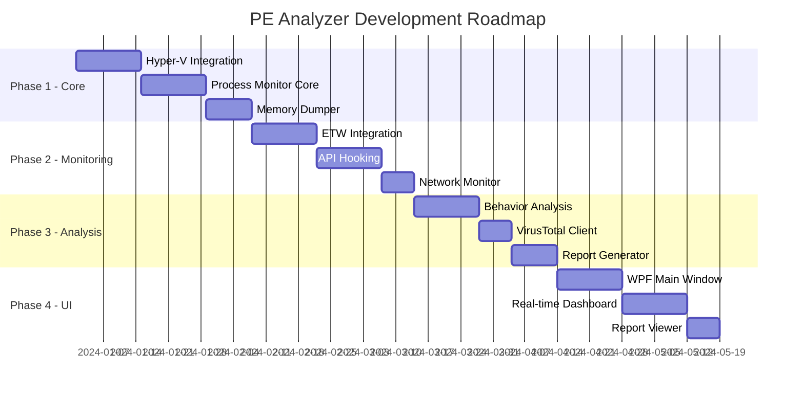

# PE 파일 동적 분석 시스템 - Hyper-V 기반 상세 구현 명세서

## 1. 기술 스택 최종 확정

```yaml
Platform: Windows 10/11 Professional or Enterprise
Runtime: .NET 6.0/7.0
Language: C# 11
GUI Framework: WPF (Windows Presentation Foundation)
Sandbox: Hyper-V with Windows Sandbox
Network: Default Hyper-V Virtual Switch
Process Monitoring: 
  - Windows ETW (Event Tracing for Windows)
  - WMI (Windows Management Instrumentation)
  - ProcMon SDK
Memory Dump: 
  - Windows Debugging API
  - MiniDumpWriteDump API
Database: SQLite with Entity Framework Core
External API: VirusTotal API v3
Logging: Serilog
```

## 2. 프로젝트 백로그 및 마일스톤

### 2.1 전체 로드맵



### 2.2 스프린트별 백로그

#### Sprint 1 (2주) - Core Infrastructure
```markdown
## User Stories
- [ ] US-001: Hyper-V VM 자동 생성 및 관리
- [ ] US-002: Windows Sandbox 통합
- [ ] US-003: 기본 파일 검증 시스템

## Technical Tasks
- [ ] T-001: Hyper-V PowerShell cmdlet 래퍼 구현 (8h)
- [ ] T-002: VM 스냅샷 관리 시스템 (8h)
- [ ] T-003: PE 파일 파서 구현 (16h)
- [ ] T-004: 데이터베이스 스키마 설계 (4h)
- [ ] T-005: 로깅 인프라 구축 (4h)

## Story Points: 40
```

#### Sprint 2 (2주) - Process Monitoring
```markdown
## User Stories
- [ ] US-004: 프로세스 생성/종료 모니터링
- [ ] US-005: 자식 프로세스 트리 추적
- [ ] US-006: API 호출 로깅

## Technical Tasks
- [ ] T-006: ETW 세션 관리자 구현 (16h)
- [ ] T-007: WMI 이벤트 구독 시스템 (8h)
- [ ] T-008: 프로세스 트리 빌더 (8h)
- [ ] T-009: API Hook 엔진 통합 (16h)
- [ ] T-010: 실시간 이벤트 큐 시스템 (8h)

## Story Points: 56
```

#### Sprint 3 (2주) - Memory & Network
```markdown
## User Stories
- [ ] US-007: 프로세스 메모리 덤프 (부모+자식)
- [ ] US-008: 네트워크 트래픽 캡처
- [ ] US-009: 파일 시스템 변경 추적

## Technical Tasks
- [ ] T-011: 메모리 덤프 매니저 (16h)
- [ ] T-012: 자식 프로세스 자동 덤프 (8h)
- [ ] T-013: 네트워크 패킷 캡처 (12h)
- [ ] T-014: 파일 시스템 와처 (8h)
- [ ] T-015: 레지스트리 모니터 (8h)

## Story Points: 52
```

#### Sprint 4 (2주) - VirusTotal Integration
```markdown
## User Stories
- [ ] US-010: VT 파일 검색 및 자동 업로드
- [ ] US-011: VT 분석 결과 통합
- [ ] US-012: 유사 샘플 검색

## Technical Tasks
- [ ] T-016: VT API v3 클라이언트 (12h)
- [ ] T-017: 파일 해시 캐싱 시스템 (4h)
- [ ] T-018: 자동 업로드 큐 관리 (8h)
- [ ] T-019: VT 결과 파서 (8h)
- [ ] T-020: 리포트 병합 엔진 (8h)

## Story Points: 40
```

## 3. WPF UI 와이어프레임

### 3.1 메인 윈도우 XAML 구조

```xml
<Window x:Class="PEAnalyzer.MainWindow"
        xmlns="http://schemas.microsoft.com/winfx/2006/xaml/presentation"
        Title="PE Dynamic Analyzer Pro" Height="900" Width="1600">
    
    <DockPanel>
        <!-- 상단 메뉴 -->
        <Menu DockPanel.Dock="Top">
            <MenuItem Header="File">
                <MenuItem Header="Open PE File" Command="{Binding OpenFileCommand}"/>
                <MenuItem Header="Batch Analysis" Command="{Binding BatchAnalysisCommand}"/>
                <Separator/>
                <MenuItem Header="Exit"/>
            </MenuItem>
            <MenuItem Header="Analysis">
                <MenuItem Header="Quick Scan"/>
                <MenuItem Header="Deep Analysis"/>
                <MenuItem Header="Custom Rules"/>
            </MenuItem>
        </Menu>
        
        <!-- 툴바 -->
        <ToolBar DockPanel.Dock="Top" Height="40">
            <Button Command="{Binding AnalyzeCommand}">
                <StackPanel Orientation="Horizontal">
                    <Image Source="/Icons/analyze.png" Width="24"/>
                    <TextBlock Text="Analyze" Margin="5,0"/>
                </StackPanel>
            </Button>
            <Separator/>
            <Button Command="{Binding StopCommand}">
                <Image Source="/Icons/stop.png" Width="24"/>
            </Button>
        </ToolBar>
        
        <!-- 메인 컨텐츠 -->
        <Grid>
            <Grid.ColumnDefinitions>
                <ColumnDefinition Width="300"/>
                <ColumnDefinition Width="*"/>
                <ColumnDefinition Width="350"/>
            </Grid.ColumnDefinitions>
            
            <!-- 왼쪽 패널: 파일 정보 -->
            <Border Grid.Column="0" BorderBrush="#E0E0E0" BorderThickness="0,0,1,0">
                <ScrollViewer>
                    <StackPanel Margin="10">
                        <!-- 파일 드롭 영역 -->
                        <Border Height="150" 
                                BorderBrush="#007ACC" 
                                BorderThickness="2" 
                                BorderStyle="Dashed"
                                AllowDrop="True">
                            <Grid>
                                <TextBlock Text="Drop PE File Here"
                                          HorizontalAlignment="Center"
                                          VerticalAlignment="Center"
                                          FontSize="16"
                                          Foreground="#666"/>
                            </Grid>
                        </Border>
                        
                        <!-- 파일 메타데이터 -->
                        <Expander Header="File Information" IsExpanded="True" Margin="0,10">
                            <StackPanel>
                                <TextBlock Text="Name: {Binding FileName}"/>
                                <TextBlock Text="Size: {Binding FileSize}"/>
                                <TextBlock Text="MD5: {Binding MD5Hash}"/>
                                <TextBlock Text="SHA256: {Binding SHA256Hash}"/>
                            </StackPanel>
                        </Expander>
                        
                        <!-- 분석 옵션 -->
                        <Expander Header="Analysis Options" IsExpanded="True">
                            <StackPanel>
                                <CheckBox Content="Memory Dump All Processes" 
                                         IsChecked="{Binding DumpAllProcesses}"/>
                                <CheckBox Content="Network Capture" 
                                         IsChecked="{Binding NetworkCapture}"/>
                                <CheckBox Content="Auto Upload to VT" 
                                         IsChecked="{Binding AutoUploadVT}"/>
                                <Label Content="Timeout (seconds):"/>
                                <TextBox Text="{Binding Timeout}"/>
                            </StackPanel>
                        </Expander>
                    </StackPanel>
                </ScrollViewer>
            </Border>
            
            <!-- 중앙 패널: 분석 결과 -->
            <TabControl Grid.Column="1">
                <TabItem Header="Overview">
                    <ScrollViewer>
                        <Grid Margin="10">
                            <!-- 위협 점수 대시보드 -->
                            <StackPanel>
                                <Border Background="#FFF3E0" Padding="10" CornerRadius="5">
                                    <Grid>
                                        <Grid.ColumnDefinitions>
                                            <ColumnDefinition/>
                                            <ColumnDefinition/>
                                            <ColumnDefinition/>
                                        </Grid.ColumnDefinitions>
                                        
                                        <StackPanel Grid.Column="0">
                                            <TextBlock Text="Risk Score" FontWeight="Bold"/>
                                            <TextBlock Text="{Binding RiskScore}" FontSize="32"/>
                                        </StackPanel>
                                        
                                        <StackPanel Grid.Column="1">
                                            <TextBlock Text="VT Detection" FontWeight="Bold"/>
                                            <TextBlock Text="{Binding VTDetection}" FontSize="24"/>
                                        </StackPanel>
                                        
                                        <StackPanel Grid.Column="2">
                                            <TextBlock Text="Behaviors" FontWeight="Bold"/>
                                            <TextBlock Text="{Binding BehaviorCount}" FontSize="24"/>
                                        </StackPanel>
                                    </Grid>
                                </Border>
                                
                                <!-- 행위 요약 -->
                                <DataGrid ItemsSource="{Binding BehaviorSummary}" 
                                         AutoGenerateColumns="False"
                                         Margin="0,10">
                                    <DataGrid.Columns>
                                        <DataGridTextColumn Header="Category" 
                                                          Binding="{Binding Category}" 
                                                          Width="150"/>
                                        <DataGridTextColumn Header="Description" 
                                                          Binding="{Binding Description}" 
                                                          Width="*"/>
                                        <DataGridTextColumn Header="Severity" 
                                                          Binding="{Binding Severity}" 
                                                          Width="100"/>
                                    </DataGrid.Columns>
                                </DataGrid>
                            </StackPanel>
                        </Grid>
                    </ScrollViewer>
                </TabItem>
                
                <TabItem Header="Processes">
                    <!-- 프로세스 트리 뷰 -->
                    <TreeView ItemsSource="{Binding ProcessTree}">
                        <TreeView.ItemTemplate>
                            <HierarchicalDataTemplate ItemsSource="{Binding Children}">
                                <StackPanel Orientation="Horizontal">
                                    <Image Source="/Icons/process.png" Width="16"/>
                                    <TextBlock Text="{Binding ProcessName}" Margin="5,0"/>
                                    <TextBlock Text="{Binding PID}" Foreground="Gray"/>
                                </StackPanel>
                            </HierarchicalDataTemplate>
                        </TreeView.ItemTemplate>
                    </TreeView>
                </TabItem>
                
                <TabItem Header="Network">
                    <DataGrid ItemsSource="{Binding NetworkConnections}"/>
                </TabItem>
                
                <TabItem Header="Registry">
                    <DataGrid ItemsSource="{Binding RegistryOperations}"/>
                </TabItem>
                
                <TabItem Header="Files">
                    <DataGrid ItemsSource="{Binding FileOperations}"/>
                </TabItem>
                
                <TabItem Header="API Calls">
                    <DataGrid ItemsSource="{Binding APICalls}"/>
                </TabItem>
                
                <TabItem Header="Memory Dumps">
                    <ListBox ItemsSource="{Binding MemoryDumps}"/>
                </TabItem>
            </TabControl>
            
            <!-- 오른쪽 패널: 실시간 모니터링 -->
            <Border Grid.Column="2" BorderBrush="#E0E0E0" BorderThickness="1,0,0,0">
                <DockPanel>
                    <TextBlock Text="Real-time Monitor" 
                              DockPanel.Dock="Top" 
                              FontWeight="Bold" 
                              Margin="10"/>
                    
                    <ScrollViewer>
                        <ItemsControl ItemsSource="{Binding RealtimeEvents}">
                            <ItemsControl.ItemTemplate>
                                <DataTemplate>
                                    <Border BorderBrush="#E0E0E0" 
                                           BorderThickness="0,0,0,1" 
                                           Padding="10,5">
                                        <StackPanel>
                                            <TextBlock Text="{Binding Timestamp}" 
                                                      FontSize="10" 
                                                      Foreground="Gray"/>
                                            <TextBlock Text="{Binding EventType}" 
                                                      FontWeight="Bold"/>
                                            <TextBlock Text="{Binding Description}" 
                                                      TextWrapping="Wrap"/>
                                        </StackPanel>
                                    </Border>
                                </DataTemplate>
                            </ItemsControl.ItemTemplate>
                        </ItemsControl>
                    </ScrollViewer>
                </DockPanel>
            </Border>
        </Grid>
        
        <!-- 하단 상태바 -->
        <StatusBar DockPanel.Dock="Bottom" Height="25">
            <StatusBarItem>
                <TextBlock Text="{Binding Status}"/>
            </StatusBarItem>
            <Separator/>
            <StatusBarItem>
                <ProgressBar Width="200" Height="18" Value="{Binding Progress}"/>
            </StatusBarItem>
            <StatusBarItem>
                <TextBlock Text="{Binding ElapsedTime}"/>
            </StatusBarItem>
        </StatusBar>
    </DockPanel>
</Window>
```

## 4. 성능 최적화 방안

### 4.1 메모리 최적화

```csharp
public class MemoryOptimizationStrategy
{
    // 1. 스트리밍 기반 대용량 파일 처리
    public async Task ProcessLargeFile(string filePath)
    {
        const int BufferSize = 4096;
        using var stream = new FileStream(filePath, FileMode.Open, 
                                        FileAccess.Read, FileShare.Read, 
                                        BufferSize, useAsync: true);
        
        var buffer = ArrayPool<byte>.Shared.Rent(BufferSize);
        try
        {
            int bytesRead;
            while ((bytesRead = await stream.ReadAsync(buffer, 0, BufferSize)) > 0)
            {
                // Process chunk
                await ProcessChunk(buffer.AsMemory(0, bytesRead));
            }
        }
        finally
        {
            ArrayPool<byte>.Shared.Return(buffer);
        }
    }
    
    // 2. 메모리 덤프 압축 및 청킹
    public class MemoryDumpOptimizer
    {
        private readonly MemoryPool<byte> _memoryPool;
        
        public async Task DumpProcessMemory(int processId)
        {
            // 청크 단위로 메모리 덤프
            const int ChunkSize = 10 * 1024 * 1024; // 10MB chunks
            
            using var process = Process.GetProcessById(processId);
            var modules = process.Modules;
            
            foreach (ProcessModule module in modules)
            {
                // 압축 스트림으로 직접 쓰기
                using var fileStream = File.Create($"dump_{processId}_{module.ModuleName}.gz");
                using var gzipStream = new GZipStream(fileStream, CompressionLevel.Optimal);
                
                await DumpModuleMemory(module, gzipStream, ChunkSize);
            }
        }
    }
}
```

### 4.2 Hyper-V 최적화

```csharp
public class HyperVOptimization
{
    // 1. VM 풀링 시스템
    public class VMPool
    {
        private readonly ConcurrentQueue<VMInstance> _availableVMs;
        private readonly SemaphoreSlim _semaphore;
        
        public VMPool(int poolSize)
        {
            _availableVMs = new ConcurrentQueue<VMInstance>();
            _semaphore = new SemaphoreSlim(poolSize);
            
            // 미리 VM 생성 및 준비
            for (int i = 0; i < poolSize; i++)
            {
                var vm = CreateAndPrepareVM();
                _availableVMs.Enqueue(vm);
            }
        }
        
        public async Task<VMInstance> AcquireVMAsync()
        {
            await _semaphore.WaitAsync();
            
            if (_availableVMs.TryDequeue(out var vm))
            {
                // 스냅샷으로 빠른 복원
                await vm.RestoreSnapshotAsync("clean_state");
                return vm;
            }
            
            throw new InvalidOperationException("No VM available");
        }
        
        public void ReleaseVM(VMInstance vm)
        {
            _availableVMs.Enqueue(vm);
            _semaphore.Release();
        }
    }
    
    // 2. 차등 디스크 활용
    public class DifferentialDiskManager
    {
        public async Task<string> CreateDifferentialDisk(string parentVHD)
        {
            var diffVHD = Path.Combine(Path.GetTempPath(), $"{Guid.NewGuid()}.vhdx");
            
            await PowerShell.Create()
                .AddCommand("New-VHD")
                .AddParameter("Path", diffVHD)
                .AddParameter("ParentPath", parentVHD)
                .AddParameter("Differencing")
                .InvokeAsync();
            
            return diffVHD;
        }
    }
}
```

### 4.3 ETW 성능 최적화

```csharp
public class ETWPerformanceOptimization
{
    // 1. 버퍼링 및 배치 처리
    public class BufferedETWProcessor
    {
        private readonly Channel<ETWEvent> _eventChannel;
        private readonly List<ETWEvent> _buffer;
        private readonly Timer _flushTimer;
        
        public BufferedETWProcessor()
        {
            _eventChannel = Channel.CreateUnbounded<ETWEvent>();
            _buffer = new List<ETWEvent>(1000);
            _flushTimer = new Timer(FlushBuffer, null, TimeSpan.FromSeconds(1), 
                                   TimeSpan.FromSeconds(1));
        }
        
        public async Task ProcessEvents()
        {
            await foreach (var evt in _eventChannel.Reader.ReadAllAsync())
            {
                _buffer.Add(evt);
                
                if (_buffer.Count >= 1000)
                {
                    await FlushBufferAsync();
                }
            }
        }
        
        private async Task FlushBufferAsync()
        {
            if (_buffer.Count == 0) return;
            
            // 배치 삽입으로 DB 성능 향상
            using var context = new AnalysisDbContext();
            await context.BulkInsertAsync(_buffer);
            _buffer.Clear();
        }
    }
    
    // 2. 선택적 이벤트 필터링
    public class ETWEventFilter
    {
        private readonly HashSet<string> _interestingProcesses;
        private readonly HashSet<string> _interestingAPIs;
        
        public bool ShouldCapture(ETWEvent evt)
        {
            // 관심 프로세스만 캡처
            if (!_interestingProcesses.Contains(evt.ProcessName))
                return false;
            
            // 중요 API만 캡처
            if (evt.EventType == "APICall" && 
                !_interestingAPIs.Contains(evt.APIName))
                return false;
            
            return true;
        }
    }
}
```

## 5. 설정 템플릿 샘플

### 5.1 appsettings.json

```json
{
  "PEAnalyzer": {
    "HyperV": {
      "VMName": "MalwareAnalysisVM",
      "VMPath": "C:\\VMs\\Analysis",
      "VHDTemplatePath": "C:\\VMs\\Templates\\Windows10_Clean.vhdx",
      "Memory": 4096,
      "ProcessorCount": 2,
      "NetworkSwitch": "Default Switch",
      "EnableNestedVirtualization": false,
      "AutoStartVM": true,
      "VMPoolSize": 3
    },
    
    "Monitoring": {
      "CaptureAllChildProcesses": true,
      "MaxProcessTreeDepth": 10,
      "MemoryDumpOptions": {
        "DumpType": "Full",
        "CompressOutput": true,
        "MaxDumpSize": 2147483648,
        "IncludeChildProcesses": true,
        "DumpOnProcessExit": true,
        "DumpInterval": 30
      },
      "ETWProviders": [
        {
          "Name": "Microsoft-Windows-Kernel-Process",
          "Keywords": "0xFFFFFFFFFFFFFFFF",
          "Level": "Verbose"
        },
        {
          "Name": "Microsoft-Windows-Kernel-File",
          "Keywords": "0xFFFFFFFFFFFFFFFF",
          "Level": "Informational"
        },
        {
          "Name": "Microsoft-Windows-Kernel-Registry",
          "Keywords": "0xFFFFFFFFFFFFFFFF",
          "Level": "Informational"
        }
      ],
      "APIHooks": {
        "Enabled": true,
        "TargetDLLs": [
          "kernel32.dll",
          "ntdll.dll",
          "advapi32.dll",
          "ws2_32.dll",
          "wininet.dll"
        ],
        "MaxHookCount": 10000
      }
    },
    
    "VirusTotal": {
      "APIKey": "${VT_API_KEY}",
      "AutoUpload": true,
      "UploadIfNotFound": true,
      "WaitForAnalysis": true,
      "MaxWaitTime": 300,
      "RetryCount": 3,
      "RetryDelay": 10,
      "IncludeBehaviorReport": true,
      "CacheResults": true,
      "CacheDuration": 86400
    },
    
    "Analysis": {
      "DefaultTimeout": 300,
      "KillOnTimeout": true,
      "MaxConcurrentAnalysis": 2,
      "ScreenshotInterval": 5,
      "NetworkCapture": {
        "Enabled": true,
        "CaptureFilter": "tcp or udp",
        "MaxCaptureSize": 104857600,
        "SavePCAP": true
      },
      "BehaviorDetection": {
        "EnableYaraRules": true,
        "YaraRulesPath": "C:\\Rules\\yara",
        "EnableSigmaRules": true,
        "SigmaRulesPath": "C:\\Rules\\sigma"
      }
    },
    
    "Database": {
      "Provider": "SQLite",
      "ConnectionString": "Data Source=C:\\PEAnalyzer\\analysis.db",
      "EnableLogging": false,
      "CommandTimeout": 30,
      "RetentionDays": 90
    },
    
    "Reporting": {
      "OutputDirectory": "C:\\PEAnalyzer\\Reports",
      "DefaultFormat": "HTML",
      "IncludeScreenshots": true,
      "IncludeMemoryDumps": false,
      "IncludePCAP": true,
      "CompressReport": true,
      "EmailNotification": {
        "Enabled": false,
        "SMTPServer": "smtp.example.com",
        "From": "analyzer@example.com",
        "To": ["security@example.com"]
      }
    },
    
    "Performance": {
      "EnableCaching": true,
      "CacheSize": 1073741824,
      "ThreadPoolSize": 16,
      "AsyncIOThreads": 8,
      "EnableCompression": true,
      "BufferSize": 65536,
      "BatchInsertSize": 1000,
      "EventQueueSize": 10000
    },
    
    "Security": {
      "EnableTLS": true,
      "CertificatePath": "C:\\Certs\\analyzer.pfx",
      "EncryptDatabase": true,
      "EncryptMemoryDumps": true,
      "SecureDelete": true,
      "AuditLogging": true
    }
  },
  
  "Serilog": {
    "MinimumLevel": {
      "Default": "Information",
      "Override": {
        "Microsoft": "Warning",
        "System": "Warning"
      }
    },
    "WriteTo": [
      {
        "Name": "File",
        "Args": {
          "path": "C:\\PEAnalyzer\\Logs\\log-.txt",
          "rollingInterval": "Day",
          "retainedFileCountLimit": 30
        }
      }
    ]
  }
}
```

### 5.2 분석 프로파일 템플릿 (profiles.json)

```json
{
  "Profiles": [
    {
      "Name": "Quick Scan",
      "Description": "Fast basic analysis",
      "Settings": {
        "Timeout": 60,
        "MemoryDump": false,
        "NetworkCapture": false,
        "VirusTotalUpload": true,
        "DetailLevel": "Basic"
      }
    },
    {
      "Name": "Standard Analysis",
      "Description": "Balanced analysis with moderate detail",
      "Settings": {
        "Timeout": 300,
        "MemoryDump": true,
        "NetworkCapture": true,
        "VirusTotalUpload": true,
        "DetailLevel": "Standard",
        "DumpChildProcesses": true
      }
    },
    {
      "Name": "Deep Analysis",
      "Description": "Comprehensive analysis with all features",
      "Settings": {
        "Timeout": 600,
        "MemoryDump": true,
        "NetworkCapture": true,
        "VirusTotalUpload": true,
        "DetailLevel": "Detailed",
        "DumpChildProcesses": true,
        "UnpackSamples": true,
        "ExtractStrings": true,
        "DecompileCode": true
      }
    },
    {
      "Name": "Ransomware Analysis",
      "Description": "Specialized profile for ransomware",
      "Settings": {
        "Timeout": 900,
        "MemoryDump": true,
        "NetworkCapture": true,
        "FileSystemMonitoring": "Aggressive",
        "CryptoAPIMonitoring": true,
        "ShadowCopyMonitoring": true,
        "BackupFilesBeforeExecution": true
      }
    }
  ]
}
```

## 6. 실행 예제 및 워크플로우

### 6.1 CLI 실행 예제

```powershell
# 기본 분석
.\PEAnalyzer.exe analyze sample.exe

# 프로파일 사용
.\PEAnalyzer.exe analyze sample.exe --profile "Deep Analysis"

# 배치 분석
.\PEAnalyzer.exe batch C:\Samples --output C:\Reports --concurrent 3

# 실시간 모니터링
.\PEAnalyzer.exe monitor --execution-id 12345 --follow

# VT 전용 스캔
.\PEAnalyzer.exe vt-scan sample.exe --upload-if-missing --wait
```

### 6.2 자동화 워크플로우 스크립트

```powershell
# AutoAnalysis.ps1
param(
    [string]$SampleDirectory,
    [string]$OutputDirectory
)

$samples = Get-ChildItem $SampleDirectory -Filter "*.exe"

foreach ($sample in $samples) {
    Write-Host "Analyzing: $($sample.Name)"
    
    # 분석 실행
    $result = .\PEAnalyzer.exe analyze $sample.FullName `
        --profile "Standard Analysis" `
        --output-format json `
        --output-dir $OutputDirectory
    
    # 위험도 체크
    $analysis = Get-Content "$OutputDirectory\$($sample.BaseName).json" | ConvertFrom-Json
    
    if ($analysis.RiskScore -gt 70) {
        # 고위험 샘플은 심층 분석
        .\PEAnalyzer.exe analyze $sample.FullName `
            --profile "Deep Analysis" `
            --output-dir "$OutputDirectory\HighRisk"
    }
}
```

이 명세서는 즉시 개발을 시작할 수 있는 상세한 가이드를 제공합니다. 추가로 필요한 부분이나 특정 모듈의 구체적인 구현 코드가 필요하시면 말씀해 주세요.
